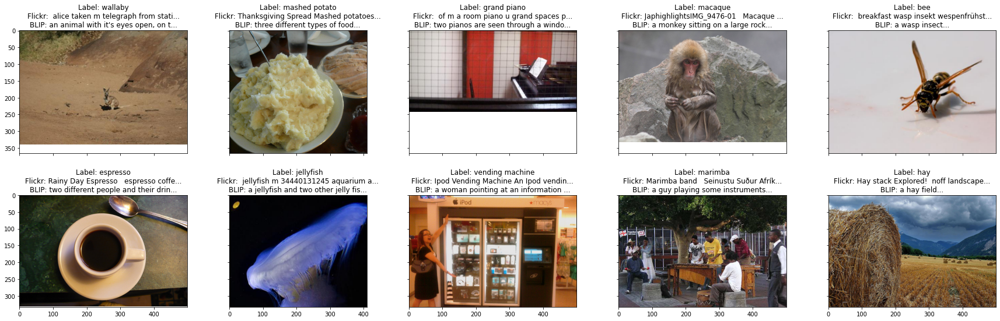

# CaptionNet

**CaptionNet** is a dataset for training and evaluating caption-supervised models.

# What is in CaptionNet?

CaptionNet provides metadata and image links for four new training datasets; all of these datasets are designed for evaluation on a subset of 100 classes chosen from ImageNet-1000. 

Each dataset in CaptionNet is either a subset or a superset of an existing dataset, and each is fully captioned and fully labeled, either using annotated or synthetic labels.

For additional details on our methodology for gathering CaptionNet, as well as explanations of terms like "subset matching", please refer to our paper.

1.  **ImageNet-100:** A superset of ImageNet with over 50,000 newly
    annotated samples, including flickr-captions and blip-captions.

2.  **OpenImages-100:** A subset of OpenImages with new mappings from
    OpenImages to ImageNet classes, restored original flickr-captions,
    and new BLIP-captions.

3.  **LAION-100:** A subset of LAION-15m with samples selected via
    subset matching.

4.  **YFCC-100:** A subset of YFCC-15m with samples selected via subset
    matching.

# How to Get CaptionNet

Downloading CaptionNet is a straightforward process;

1. Download the four metadata spreadsheets from **Google Drive**: https://drive.google.com/file/d/1jvpvDjjLYY0ry2awP3NyacQUqPZfqPQC/
2. Load the spreadsheets in your favorite CSV reader; we recommend pandas
3. Download all linked images by referencing the URL column of each spreadsheet. Please note that links to original ImageNet images are not included; for these images, please use the filename column to match the metadata to the appropriate image in your local copy of ImageNet.
4. Update the path column to point to your newly downloaded image files

# Training on CaptionNet

CaptionNet is designed to allow researchers to easily compare the effects of different labeling strategies on model performance. As such, every subset of CaptionNet includes at least two labeling sources.

* **idx** labels are integers, mapping to [ImageNet-1k class labels](https://deeplearning.cms.waikato.ac.nz/user-guide/class-maps/IMAGENET/)
* **caption** labels are natural language captions (usually in English), and are suitable for training VL-loss models like [CLIP](https://openai.com/blog/clip/)

For YFCC-100 and LAION-100, the idx labels are synthetic, and are generated via a simple subset matching strategy. For ImageNet-100 and OpenImages-100, the idx labels are annotated by humans.

YFCC-100, ImageNet-100 and OpenImages-100 contain captions sourced from Flickr. LAION-100 contains captions sourced from alt-text descriptions. 

Additional labeling sources are available for some of the datasets in CaptionNet; please reference our paper for a reference key for all of the columns in the spreadsheets.

[VL Hub](https://github.com/penfever/vlhub/), a framework for vision language model training, can be used to reproduce the experiments in our paper.

# Evaluation on CaptionNet

Evaluation methods for CaptionNet models are the same as those for ImageNet models, except that we evaluate only on a subset of all ImageNet classes.

For details on which classes are included in CaptionNet, please see metadata/in100_classes.txt in this repo.

# Citation
